# Agentic Workflow Demo

> **LangGraph** agent running on **Crux** → **Sophia** LLM → **Aurora** GPU computing

[](https://www.python.org/downloads/)
[](LICENSE)

A demonstration of an end-to-end agentic workflow that showcases ALCF infrastructure integration. The workflow queries a language model on Sophia for protein analysis, then launches GPU-accelerated molecular dynamics simulations on Aurora via Globus Compute.

## 🏗️ Architecture

```mermaid
graph TD
   A[🔬 User: python main.py --protein p53] --> B[🧠 LangGraph Agent]
   B --> C[💬 Sophia LLM Query]
   C --> D[📊 Analysis & Parameters]
   D --> E[🚀 Globus Compute]
   E --> F[⚡ Aurora GPU Simulation]
   F --> G[📋 MD Results]
   G --> H[📄 Final Report]
   
   style A fill:#e1f5fe
   style F fill:#f3e5f5
   style H fill:#e8f5e8
```



## ⚡ Quick Start

### Prerequisites

- Python 3.8+ with virtual environment
- Access to ALCF Crux system
- Globus authentication set up
- Aurora endpoint configured

### Installation

```bash
# Clone and set up environment
git clone <repository-url>
cd agentic-workflow-demo
python -m venv venv
source venv/bin/activate

# Install dependencies
pip install -r requirements.txt
```

### Configuration

```bash
# Set required environment variables
export GC_ENDPOINT_ID="your-aurora-endpoint-id"
export OPENAI_MODEL="llama3-8b-instruct"  # Optional: defaults to this

# Verify setup
python scripts/globus_check.py
```

> **Aurora Endpoint Setup**: The repository must also be available on Aurora with dependencies installed. See [`docs/setup-crux.md`](docs/setup-crux.md) for complete endpoint configuration including PYTHONPATH setup.

### Run Demo

```bash
# Basic run with p53 protein
python src/main.py --protein p53

# Custom protein and verbose logging
python src/main.py --protein insulin --log-level DEBUG

# Full options
python src/main.py \
   --protein myoglobin \
   --model gpt-4 \
   --endpoint custom-endpoint-id \
   --log-level INFO \
   --max-simulation-time 120
```

**Expected output:**
```
🚀 Starting Agentic Workflow Demo
🧠 Querying LLM for protein analysis...
✅ LLM analysis completed
🚀 Launching GPU simulation on Aurora...
✅ Simulation completed: completed
📊 Generating final report...
⏱️  Workflow completed in 45.2s

============================================================
## Molecular Dynamics Analysis Report - p53

**Status**: ✅ COMPLETED
**Timestamp**: 15-12 14:30

### Simulation Parameters
- Temperature: 300 K
- Timestep: 0.002 ps
- Steps: 10000

### Results
- Stability Score: 0.821
- RMSD: 1.234 Å
- Final Energy: -12456.7 kJ/mol

### Analysis
The protein p53 simulation has been completed successfully on Aurora.
============================================================
```

## 📁 Project Structure

```
agentic-workflow-demo/
├── src/
│   ├── main.py              # CLI orchestrator with LangGraph
│   ├── sim_kernel.py        # OpenMM simulation for Aurora
│   └── tools/
│       └── compute.py       # Globus Compute wrapper
├── scripts/
│   └── globus_check.py      # Environment verification
├── tests/
│   └── test_smoke.py        # Unit tests with mocks
├── docs/
│   └── setup-crux.md        # Crux setup instructions
├── requirements.txt         # Python dependencies
└── README.md               # This file
```

## 🔧 Components

### LangGraph Agent (`src/main.py`)
- **Purpose**: Orchestrates the entire workflow
- **Features**: CLI interface, logging, error handling
- **Nodes**: LLM analysis → Simulation → Report generation

### Simulation Kernel (`src/sim_kernel.py`)
- **Purpose**: Runs MD simulations on Aurora GPUs
- **Technology**: OpenMM with OpenCL for Intel GPUs
- **Output**: Energy, RMSD, stability metrics

### Globus Compute Wrapper (`src/tools/compute.py`)
- **Purpose**: Submits and monitors remote compute jobs
- **Features**: Job submission, timeout handling, status checks
- **Target**: Aurora compute nodes

### Environment Checker (`scripts/globus_check.py`)
- **Purpose**: Validates setup before running workflow
- **Checks**: Python packages, Globus auth, endpoint status
- **Usage**: `python scripts/globus_check.py`

## 📊 Simulation Details

The demo runs simplified molecular dynamics simulations with the following characteristics:

- **Duration**: 10,000 steps × 2 fs = 20 ps simulation time
- **Output**: Stability metrics, RMSD, potential energy
- **Hardware**: Intel GPU acceleration on Aurora
- **Timeout**: 3 minutes maximum (configurable)

> **Note**: This is a demonstration with simplified physics. Real MD simulations would require proper force fields, solvation, and longer timescales.

## 🚀 Extension Ideas

| Extension | Description | Difficulty |
|-----------|-------------|------------|
| **Real PDB structures** | Load actual protein structures from RCSB PDB | ⭐⭐ |
| **Force field selection** | Support AMBER, CHARMM, OPLS force fields | ⭐⭐⭐ |
| **Trajectory analysis** | Add contact maps, secondary structure analysis | ⭐⭐⭐ |
| **Multi-protein systems** | Support protein-protein interaction studies | ⭐⭐⭐⭐ |
| **Free energy calculations** | Implement umbrella sampling, FEP methods | ⭐⭐⭐⭐⭐ |

## 🧪 Testing

```bash
# Run unit tests
python -m pytest tests/ -v

# Run with coverage
python -m pytest tests/ --cov=src --cov-report=html

# Test individual components
python -m pytest tests/test_smoke.py::TestCLI -v
```

## 📚 Documentation

- **Setup Guide**: [`docs/setup-crux.md`](docs/setup-crux.md)
- **API Reference**: Docstrings in source code
- **Examples**: See [`tests/test_smoke.py`](tests/test_smoke.py)

## 🐛 Troubleshooting

### Common Issues

1. **"GC_ENDPOINT_ID not set"**
   ```bash
   export GC_ENDPOINT_ID="your-endpoint-id"
   python scripts/globus_check.py
   ```

2. **"Globus tokens expired"**
   ```bash
   globus login
   ```

3. **"Missing packages"**
   ```bash
   pip install -r requirements.txt
   ```

4. **Simulation timeout**
   - Check Aurora endpoint status
   - Increase `--max-simulation-time`
   - Verify network connectivity to Aurora

### Debug Mode

```bash
python src/main.py --protein p53 --log-level DEBUG
```

## 🤝 Contributing

This is a demonstration project for ALCF users. For suggestions or improvements:

1. Test your changes: `python -m pytest tests/`
2. Follow 3-space indentation style
3. Keep total LOC under 300 (per project guidelines)
4. Update documentation for new features

## 📄 License

MIT License - see LICENSE file for details.

---

**Questions?** Contact the ALCF user support team or check the [ALCF documentation](https://docs.alcf.anl.gov/). 